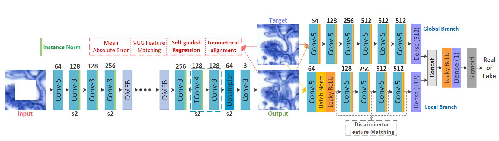
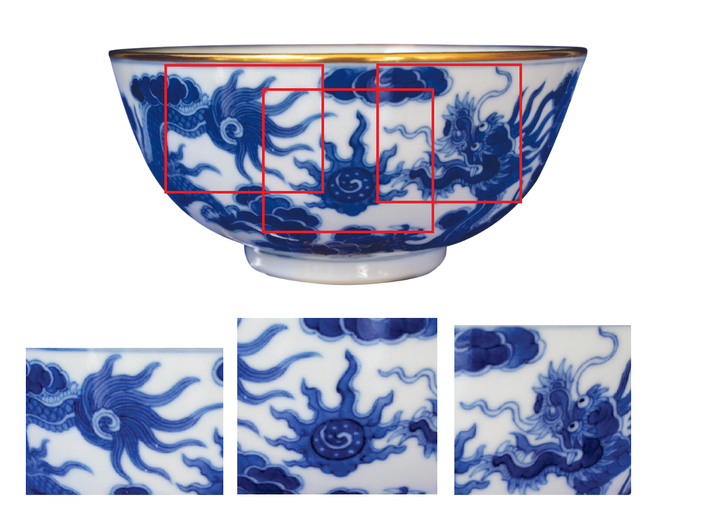
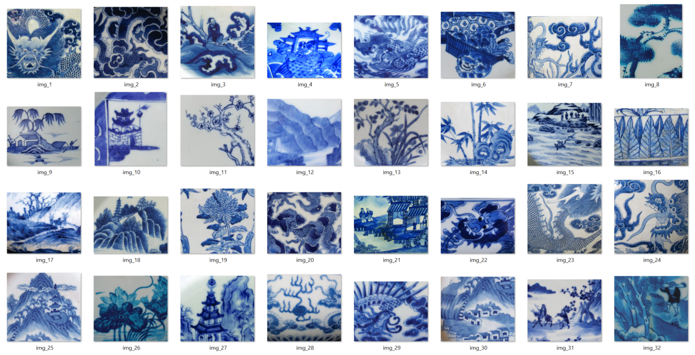
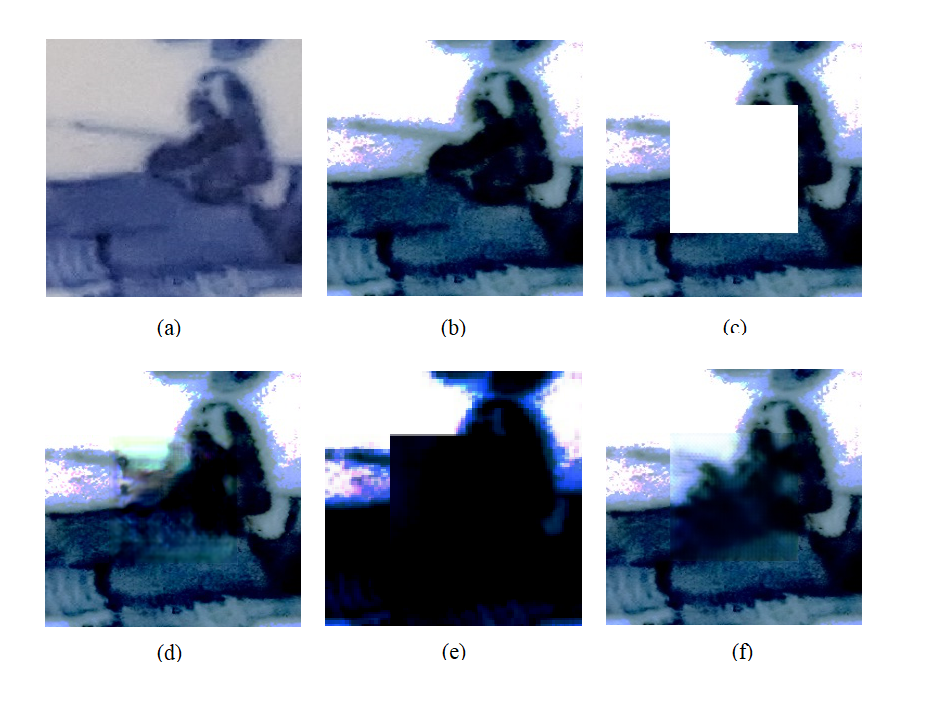
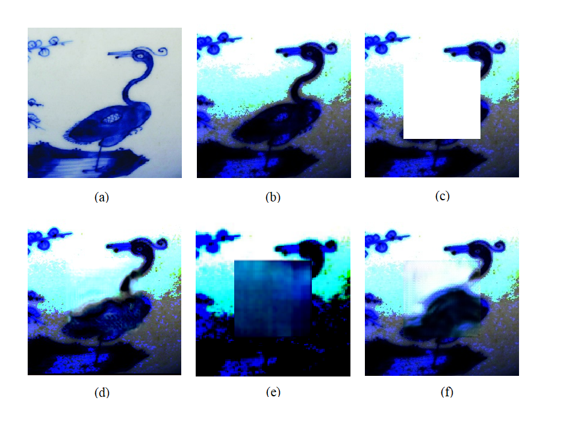
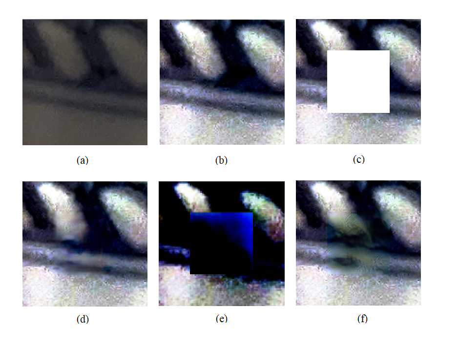
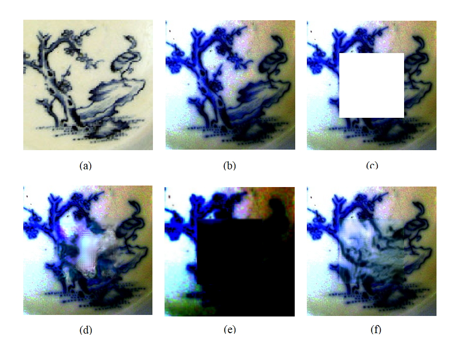
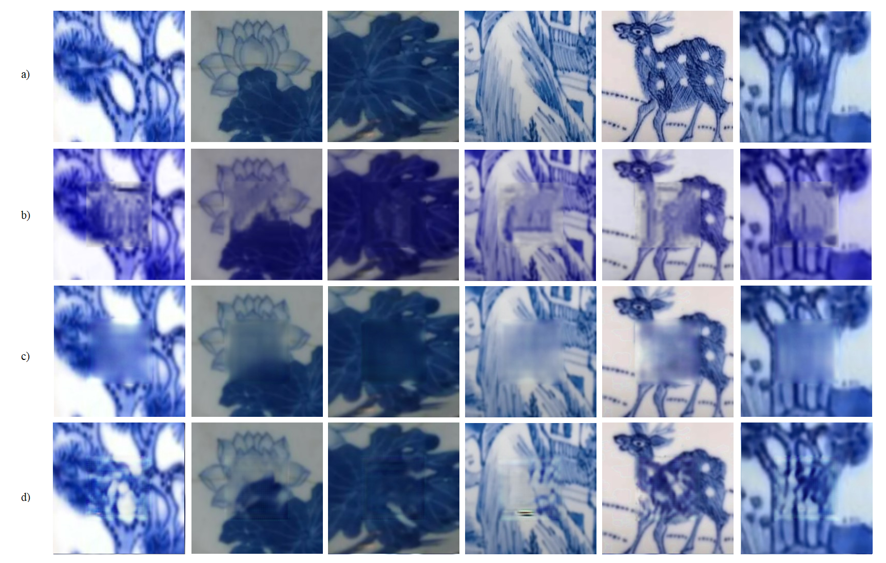

## DMFN (Dense Multi-scale Fusion Network)

This is an unoffical repository for reproducing model DMFN from the paper [[Image Fine-grained Inpainting]](https://arxiv.org/abs/2002.02609). The original repository is [here](https://github.com/Zheng222/DMFN), but author have not commit the rest of implement code yet. 

<p align="center">
  
</p>

## Prerequisites
- Python3.5 (or higher)
- pytorch 1.0(or higher) with GPU
- numpy
- OpenCV
- scipy
- tensorboardX


## RESULT

### Dataset
<p align="center">
  
  

</p>

### Result
<p align="center">
  <h4> Result for HCMC Contest</h4>
  
  
  
  
  <h4> Result for Da Nang - Resfes 2023 Final Contest</h4>
  `
  
  
</p>

## Prepare the images used for training
contact us: yesure2023@gmail.com

## How to test

You can specify the folder address by the option --dataset_path, and set the pretrained model path by --load_model_dir when calling test.py as the following

```
python test.py --dataset yesuredata/test --data_file yesuretxt/test.txt --load_model_dir checkpoints/40_net_DFBN.pth
```
**We trained it first time [40 epochs with single GPU - GTX 1650](https://drive.google.com/file/d/1R7DzEdmYuhbEZJcKd5s-VDC5sJtNMmPC/view?usp=sharing), and also train again with advance image processing method, [50 epochs on single GTX 3060Ti](https://drive.google.com/file/d/1JRZBheVu8RJITSSXF2BavfThOMZ641x_/view?usp=drive_link)**, you can train it yourself for better performance or in custom dataset.

## How to train
Use train.py as the following 
```
python train.py --dataset_path data_final --data_file yesuretxt/train1.txt --batch_size 4 --lr 2e-4 --epochs 40 --load_model_dir checkpoints/40_net_DFBN.pth
```
You can load the pretrained model by the option --load_model_dir and edit default params in 2 python files in 'options' folder, too.

## Refs

- [x] 中文博客(https://blog.csdn.net/h8832077/article/details/105166776)
